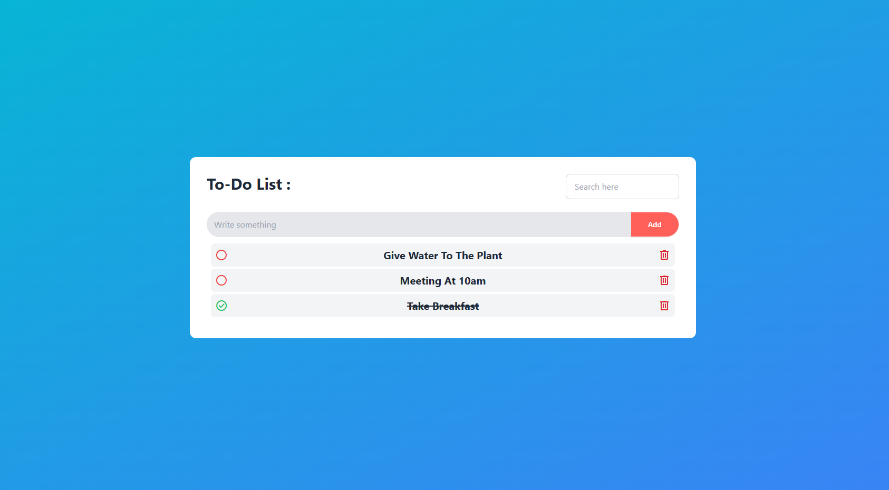

# Task Manager

This is a task management application that allows users to easily add tasks with just a few clicks. Users can mark tasks as completed by clicking the radio button next to each task and delete tasks using the delete icon. One of the most interesting features of this app is task prioritization—users can simply drag and drop tasks to reorder them by priority. Additionally, this application is fully responsive for all devices.

## How to Run on Your Local Device

You can run this application on your local machine with just a few steps:

1. Clone this repository to your local machine.
2. Open the project in a code editor or terminal.
3. Install all dependencies by running `npm install` or `npm i`.
4. Finally, start the project with the `npm run dev` command.

## Demo

[Live website is here](https://dashing-churros-6b133b.netlify.app/)

## Screenshots

